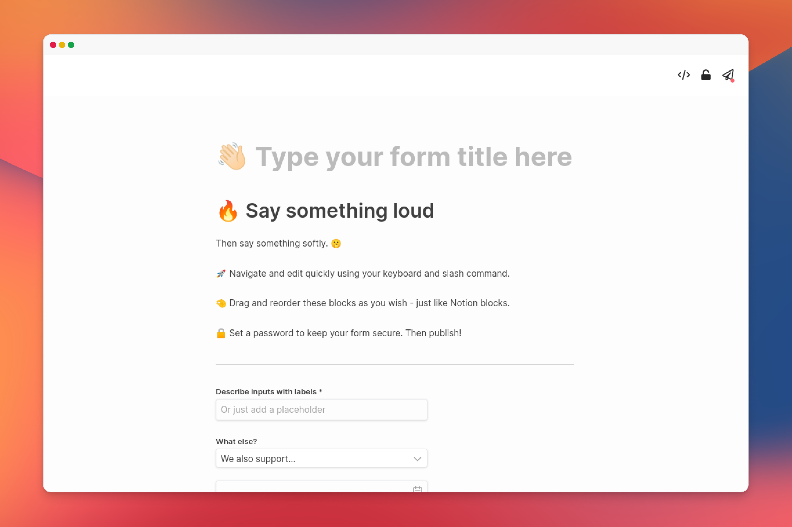

<p align="center">

<h1 align="center"><b>Dashibase Insert</b></h1>
<p align="center">
  Notion-esque form-builder for Supabase users.
    <br />
    <a href="https://dashibase.com/insert"><strong>Build your form now 📜</strong></a>
  </p>
</p>

Design your next form with a beautiful Notion-esque UI, integrated with your Supabase project.

Inspired by Notion and Tally, built with Vue, Tailwind and Supabase.

<p align="center">
  
  <br />
  <br />
  <a href="https://dashibase.com/insert">
    
  </a>
  <a href="https://twitter.com/dashibase">
    
  </a>
  <a href="https://join.slack.com/t/dashibase-community/shared_invite/zt-180rycyqv-ifRwyiQAiXUlBBVxgxQE7g">
    
  </a>
  
  <br />
</p>

**We have a [hosted version](https://dashibase.com/insert) you can use for free!**

But we also open-sourced our code, warts and all, for folks interested in how we coded up a Notion-like interface with Vue (see `src/components/editor` for the relevant components) or wishing to self-host (see below for instructions).

Contributions welcome!

**Have suggestions for what to work on next? Join our [Slack](https://join.slack.com/t/dashibase-community/shared_invite/zt-180rycyqv-ifRwyiQAiXUlBBVxgxQE7g) and let us know!**

---

## Features

- [x] Notion-esque UI - navigate with keyboard shortcuts or rearrange blocks and components
- [x] Integrated with Supabase
- [x] Automatically detect required columns based on table schema
- [x] Automatically detect input types based on PostgreSQL data types
- [x] Embed forms on your own sites and supports logged-in users and RLS (for hosted version)
- [x] Add a password to restrict access to forms

## Getting Started with Self-hosting

**0. Set up your Supabase**

If you don't have a Supabase project yet, [head over](https://supabase.com) and create one.

Then you'll need to create a table to store metadata about your forms.

The simplest way to do this would be to just run the following SQL snippet in the Supabase SQL Editor.

```sql
CREATE TABLE forms (
  id uuid DEFAULT uuid_generate_v4(),
  "user" uuid REFERENCES auth.users NOT NULL,
  supabase_url text NOT NULL,
  supabase_anon_key text NOT NULL,
  table_id text NOT NULL,
  title text DEFAULT '' NOT NULL,
  blocks json DEFAULT '[]'::json NOT NULL,
  button_label text DEFAULT 'Submit' NOT NULL,
  -- Optional password_hash if setting password is supported, see Step 4
  password_hash text NOT NULL,

  PRIMARY KEY (id)
)
```

**1. Clone this repository, go to the root directory and install packages**

```bash
git clone https://github.com/dashibase/dashibase-insert
cd dashibase-insert
npm i
```

**2. Configure environment variables**

Create a `.env` file with the following variables.

```
VITE_SUPABASE_URL=<YOUR SUPABASE URL>
VITE_SUPABASE_ANON_KEY=<YOUR SUPABASE ANON KEY>
VITE_TABLE_ID=forms
```

**3. Test it locally**

```bash
npm run dev
```

By default, this conjures a version of Dashibase Insert without embed or password support.

You should be able to log in with an account in your own Supabase project, then create and view forms.

**4. Enable password setting**

Setting a password entails more work for a few reasons:

- We need something to hash the password on the backend when it is set - with Dashibase Insert, we use a Postgres trigger
- We need something to validate the password on the backend when the form is requested - with Dashibase Insert, we use AWS Lambda

The following is a sample of a possible Postgres trigger, run before the `forms` table is updated or inserted. Here we concat the password with the form ID and then hash that with SHA256.

```sql
BEGIN
  IF (OLD.password_hash IS DISTINCT FROM NEW.password_hash) THEN
    IF NOT (NEW.password_hash = '') THEN
      NEW.password_hash=digest(NEW.password_hash||NEW.id, 'sha256');
    END IF;
  END IF;
  RETURN NEW;
END;
```

Here is a sample of what the serverless function to validate passwords may look like. (If you are using AWS Lambda, see [here](https://docs.aws.amazon.com/lambda/latest/dg/nodejs-package.html) for details about how to deploy Node.js Lambda functions with packages.)

```js
exports.handler = async (event) => {
  const Supabase = require('@supabase/supabase-js')
  const hash = require('hash.js')
  const supabaseUrl = process.env.SUPABASE_URL
  const supabaseAnonKey = process.env.SUPABASE_ANON_KEY
  const supabase = Supabase.createClient(supabaseUrl, supabaseAnonKey)
  await supabase.auth.signIn({
    email: process.env.SUPABASE_EMAIL,
    password: process.env.SUPABASE_PASSWORD,
  })
  const form_id = JSON.parse(event.body).form_id
  const password = JSON.parse(event.body).password
  let { data, error } = await supabase
    .from(process.env.TABLE_ID)
    .select('title,blocks,supabase_url,supabase_anon_key,password_hash,button_label,table_id')
    .eq("id", form_id)
    .single()
  if (error) {
    return {
      statusCode: 401,
      body: JSON.stringify('No form found'),
      headers: {
        'Access-Control-Allow-Origin': '*',
      },
    }
  }
  if (data.password_hash) {
    if (!password) {
      // If password is required but not supplied, return 403  
      return {
        statusCode: 403,
        body: JSON.stringify('Password required'),
        headers: {
          'Access-Control-Allow-Origin': '*',
        },
      }
    } else {
      // If password is supplied, run SHA256 on password concat with form ID,
      // or whatever you did previously with your Postgres trigger
      const password_hash = hash.sha256().update(password + form_id).digest('hex')
      if (password_hash === data.password_hash.slice(2)) {
        // If it matches, hurray return 200 with form details
        return {
          statusCode: 200,
          body: JSON.stringify({
            'title': data.title,
            'blocks': data.blocks,
            'supabase_url': data.supabase_url,
            'supabase_anon_key': data.supabase_anon_key,
            'table_id': data.table_id,
            'button_label': data.button_label,
          }),
          headers: {
            'Access-Control-Allow-Origin': '*',
          },
        }
      } else {
        // Otherwise return a 403
        return {
          statusCode: 403,
          body: JSON.stringify('Incorrect password'),
          headers: {
            'Access-Control-Allow-Origin': '*',
          },
        }
      }
    }
  }
  // If password is not required, just return the form details   
  return {
    statusCode: 200,
    body: JSON.stringify({
      'title': data.title,
      'blocks': data.blocks,
      'supabase_url': data.supabase_url,
      'supabase_anon_key': data.supabase_anon_key,
      'table_id': data.table_id,
      'button_label': data.button_label,
    }),
    headers: {
      'Access-Control-Allow-Origin': '*',
    },
  }
};
```

After setting these up, you can add your Serverless URL to your `.env` file and enable password setting.

```
VITE_LAMBDA_URL=<YOUR LAMBDA URL>
VITE_ENABLE_PASSWORD=true
```

Then test it locally with the following.

```bash
npm run dev
```
